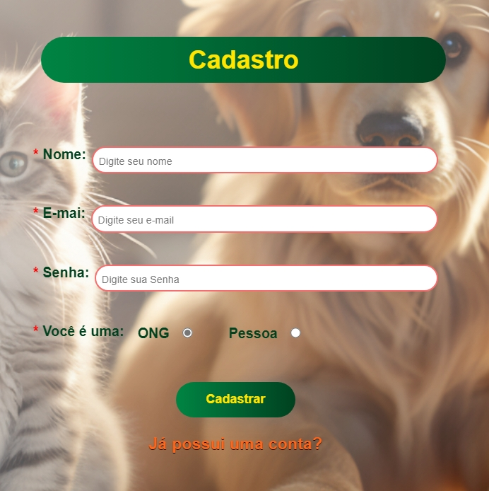
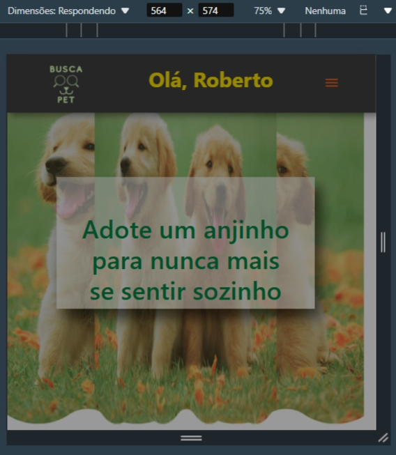
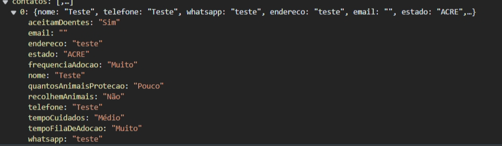
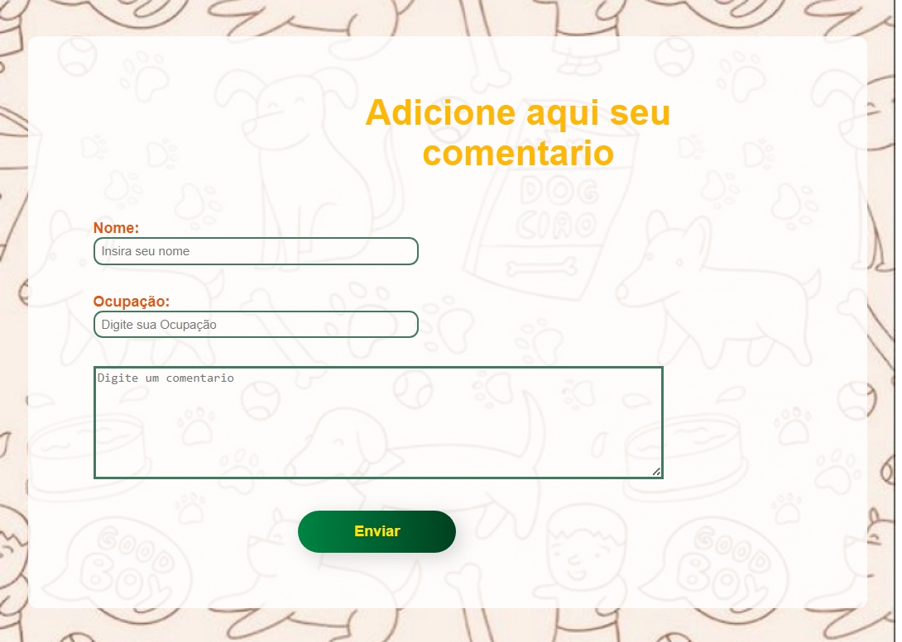

<<<<<<< HEAD:docs/02 - relatório técnico/Relatorio Tecnico - TEMPLATE.md
# Informações do Projeto
`TÍTULO DO PROJETO`  

<h3>BuscaPet</h3>

`CURSO` 

<h3>Sistema de Informação</h3>

## Participantes

<ul>
  <li>ANIELLE CARLA DE OLIVEIRA</li>
  <li>BRENO PINHEIRO DE OLIVEIRA</li>
  <li>DEBORAH FERNANDES BARBOSA</li>
  <li>INGRID YARA ALVES DOS SANTOS</li>
  <li>JOÃO FELIPE DA SILVA PRADO</li>
  <li>RODRIGO OLIVEIRA NUNES</li>
</ul>

# Estrutura do Documento

- [Informações do Projeto](#informações-do-projeto)
  - [Participantes](#participantes)
- [Estrutura do Documento](#estrutura-do-documento)
- [Introdução](#introdução)
  - [Problema](#problema)
  - [Objetivos](#objetivos)
  - [Justificativa](#justificativa)
  - [Público-Alvo](#público-alvo)
- [Especificações do Projeto](#especificações-do-projeto)
  - [Personas e Mapas de Empatia](#personas-e-mapas-de-empatia)
  - [Histórias de Usuários](#histórias-de-usuários)
  - [Requisitos](#requisitos)
    - [Requisitos Funcionais](#requisitos-funcionais)
    - [Requisitos não Funcionais](#requisitos-não-funcionais)
  - [Restrições](#restrições)
- [Projeto de Interface](#projeto-de-interface)
  - [User Flow](#user-flow)
  - [Wireframes](#wireframes)
- [Metodologia](#metodologia)
  - [Divisão de Papéis](#divisão-de-papéis)
  - [Ferramentas](#ferramentas)
  - [Controle de Versão](#controle-de-versão)
- [**############## SPRINT 1 ACABA AQUI #############**](#-sprint-1-acaba-aqui-)
- [Projeto da Solução](#projeto-da-solução)
  - [Tecnologias Utilizadas](#tecnologias-utilizadas)
  - [Arquitetura da solução](#arquitetura-da-solução)
- [Avaliação da Aplicação](#avaliação-da-aplicação)
  - [Plano de Testes](#plano-de-testes)
  - [Ferramentas de Testes (Opcional)](#ferramentas-de-testes-opcional)
  - [Registros de Testes](#registros-de-testes)
- [Referências](#referências)

# Introdução

## Problema

O problema se estabelece no preconceito vivenciado por esses animais que possuem características que dificultam sua adoção, como sua idade, raça, pelagem e até mesmo se portadores de alguma deficiência.  Logo sendo vítimas dessa tangência na hora de serem escolhidos como pets, prejudicando que possam ter uma vida feliz e digna. 

## Objetivos

<h4>OBJETIVO GERAL</h4>
O objetivo do projeto é dar um lar para animais que por conta de suas características físicas acabam sendo rejeitados e não escolhidos para serem adotados como os demais. Então a BuscaPet vê a necessidade de viabilizar o encontro desses bichinhos com um lugar para chamar de lar.
<h4>OBJETIVO ESPECÍFICO</h4>
O objetivo específico do projeto é criar uma aplicação que facilite o contato entre um animal que por muitos motivos não é escolhido para ser adotado e um possível adotante que possivelmente se interesse em acolher um pet que faça parte desse grupo.

## Justificativa

A justificativa se dá na necessidade de contribuir para o bem-estar de todos os animais, colaborando para que eles possam ser amados e respeitados pelas pessoas que os adotarem, e na ânsia de diminuir a desinformação nesse nicho de pets. Segundo pesquisas feitas pelo Instituto Pet, o Brasil possui, aproximadamente, cerca de 190.000 animais resgatados em situação de abandono ou sendo vítimas de maus tratos, sendo que 96% desse número corresponde a cães e gatos. Desse modo, o quadro deletério se evidencia, contribuindo para a criação de um ambiente onde a adoção desses animais é facilitada, podendo proporcionar uma melhor qualidade de vida para eles. 

## Público-Alvo

<ul>
  <li>Mulheres jovens entre 25 e 34 anos que cursam ou estão se graduando na faculdade que buscam adotar cães e gatos como companheiros.</li>
  <li>Homens adultos e solteiros entre 28 e 40 anos que se encontram inseridos no mercado de trabalho, interessados em adotar cães para passeios ao ar livre.</li>
  <li>Casais jovens, entre 25 e 35 anos que estejam morando juntos, que desejam adotar um animal de estimação para compartilhar responsabilidades e fortalecer seu relacionamento.</li>
  <li>Instituições de ajuda animal que possam se interessar em divulgar seus animais sem um lar em nosso site na esperança de que sejam adotados.</li>
</ul>
 
# Especificações do Projeto

Durante a etapa de concepção do projeto, foram levantados inúmeros dados e estátisticas que, posteriormente, foram condensados em personas e histórias de usuários. Esses dados resultantes foram fundamentais para traçarmos estrátegias para alcançarmos o maior número de pessoas para o nosso site, adicionando uma experiência personalizada e fornecendo uma compreensão aprofundada das necessidades, desejos e comportamentos dos usuários-alvo. 

## Personas e Mapas de Empatia

<h4><strong> Persona 1 </strong> </h4>

<ul> 
<li><strong>Nome:</strong></strong> Ana Santos</li>
<li><strong>Idade:</strong> 28 anos </li>
<li><strong>Profissão:</strong> Designer Gráfica</li> 
<li><strong>Hobby:</strong> Ana adora fotografia e passa seu tempo livre capturando momentos especiais em sua câmera. Ela também gosta de explorar parques e trilhas ao ar livre, sempre em busca de novas aventuras fotográficas. 
Personalidade: Ana é uma pessoa extrovertida, criativa e aventureira. Ela é uma pessoa comprometida em cuidar de seu animal de estimação e proporcionar-lhe uma vida cheia de aventuras e momentos especiais ao ar livre.</li>
</ul>

<h5>Objetos e Lugares:</h5>  
<ul>
<li><strong>Câmera fotográfica:</strong> Ana usa sua câmera fotográfica durante suas aventuras ao ar livre, em parques, trilhas e em suas viagens fotográficas.</li> 
<li><strong>Smartphone:</strong> Ana usa seu smartphone em diversos momentos do dia e em diferentes locais. Ela o utiliza em casa, no trabalho, durante suas atividades ao ar livre e em suas viagens.  </li>
<li><strong>Computador ou laptop:</strong> Ana utiliza seu computador ou laptop principalmente em casa ou no escritório. Ela o utiliza para realizar trabalhos de design gráfico, editar fotos, acessar o site de adoção de animais e interagir com a comunidade online. </li>
<li><strong>Navegador da web:</strong> Ana acessa o site de adoção de animais por meio de um navegador da web em seu computador ou laptop. Ela pesquisa informações sobre os animais disponíveis para adoção, preenche formulários de adoção e interage com outros usuários.</li>
</ul>
 
<h5>Objetivos Chave: </h5>
<ul>
<li><strong>Encontrar um companheiro animal adequado:</strong> O principal objetivo de Ana ao utilizar o serviço é encontrar um animal de estimação que se adapte ao seu estilo de vida ativo e criativo. Ela deseja encontrar um companheiro que possa acompanhá-la em suas aventuras ao ar livre e também se tornar uma fonte de inspiração para suas fotografias.</li> 
<li><strong>Contribuir para o bem-estar animal:</strong> Ana acredita firmemente em dar uma segunda chance aos animais abandonados e  adotar em abrigos em vez de comprar de criadores. Seu objetivo é contribuir para o bem-estar animal oferecendo um lar amoroso e seguro para um animal que precisa de cuidados e afeto. </li>
 
<li>Ana usaria o site para encontrar um animal de estimação que se encaixe em seu estilo de vida e que possa lhe trazer companhia e alegria. </li>
</ul>
<h5><strong>Como Devemos Tratar:</strong> </h5>
<ul>
<li>Empatia e compreensão </li>
<li>Transparência e confiabilidade </li>
<li>Suporte e orientação </li>
<li>Respeito e valorização </li>
 </ul>
<h5>Nunca Devemos: </h5>
<ul>
<li>Falta de empatia: Não levar em consideração as necessidades e desejos de Ana em relação à adoção de um animal de estimação pode fazer com que ela se sinta desvalorizada e ignorada. </li>
<li>Pressão excessiva: Pressionar Ana a adotar um animal ou tomar uma decisão rápida pode causar estresse e desconforto, especialmente se ela ainda estiver avaliando suas opções. </li>
<li>Julgamento: Julgar as escolhas de Ana em relação à adoção de um animal de estimação ou criticar sua decisão de adotar de um abrigo em vez de comprar de criadores pode fazer com que ela se sinta julgada e envergonhada.</li>
</ul>

<h4><strong>Persona 2</strong></h4>
<ul>
<li><strong>Nome:</strong> Carlos</li>
<li><strong>Idade:</strong> 35 anos</li>
<li><strong>Profissão:</strong> Analista de sistemas</li> 
<li><strong>Hobbys:</strong> Carlos é um amante dos animais e sempre sonhou em ter um pet para fazer companhia em casa. Ele gosta de passar seu tempo livre ao ar livre, praticando atividades como caminhadas e corridas. Além disso, ele é um entusiasta da natureza e gosta de aprender sobre diferentes espécies de animais.</li>
<li><strong>Personalidade:</strong> Carlos é um indivíduo tranquilo e atencioso, cujo coração se ilumina na presença de animais. Sua paixão pela natureza o conecta profundamente com o mundo ao seu redor, e ele valoriza a simplicidade e a serenidade que encontra ao ar livre. Ele é um espírito livre que busca equilíbrio entre sua vida agitada na cidade e seu desejo de estar em harmonia com a natureza.
Embora viva uma vida ocupada, Carlos é comprometido com suas responsabilidades e está determinado a oferecer o melhor cuidado possível para seu futuro companheiro peludo. Sua gentileza e paciência fazem dele um amigo confiável para qualquer animal de estimação que entre em sua vida.</li>

<h4><strong>Objetos e lugares:</strong></h4>
<ul>
<li>Tênis confortáveis e roupas esportivas para suas caminhadas e corridas ao ar livre. Parques locais e trilhas para caminhadas onde ele pode desfrutar da natureza e praticar atividades ao ar livre.</li>
<li>Laptop ou computador desktop, seu principal instrumento de trabalho para desenvolvimento, análise e resolução de problemas de software.</li>
<li>Escritórios de empresas de tecnologia, onde ele trabalha diretamente com sua equipe de desenvolvimento ou com clientes.</li>
<li>Smartphone onde ele utiliza para pesquisar sobre pet shops e centros de adoção de animais, onde ele pode encontrar seu companheiro peludo.</li>
</ul>
<h5><strong>Objetivos:</strong></h5>  
<ul>
  <li>Carlos está em busca de um companheiro leal e amoroso que possa trazer alegria e companhia para sua vida diária. Ele quer encontrar um pet que se adapte bem ao ambiente de um apartamento e que seja fácil de cuidar, mas também está aberto a investir tempo e esforço para proporcionar o melhor ambiente possível para seu novo pet.</li>

<li><strong>Desafios:</strong> Carlos mora sozinho em um apartamento pequeno e trabalha em período integral, então ele está procurando por um animal de estimação que se adapte ao seu estilo de vida ocupado e ao espaço limitado de sua casa. Ele também está preocupado com a responsabilidade de cuidar de um animal e quer garantir que escolha o pet certo para ele.</li>

<li><strong>Contribuir para o bem-estar: </strong>
<strong>Adoção responsável:</strong> Carlos optaria por adotar um animal de estimação em vez de comprar de criadores, contribuindo para reduzir o número de animais abandonados e ajudando a dar uma segunda chance a um pet que precisa de um lar amoroso.</li>

<li> Carlos usaria o site  para encontrar o companheiro perfeito para sua vida. Como ele mora em um apartamento pequeno e trabalha em período integral, um site de adoção oferece a conveniência de pesquisar e filtrar animais com base em critérios específicos, como tamanho, idade e nível de energia.</li>
</ul>

<h5><strong>Como Devemos Tratar:</strong></h5>
<ul>
<li>Empatia e compreensão</li>   
<li>Transparência e confiabilidade </li>
<li>Suporte e orientação </li>
<li>Respeito e valorização </li>
  
<h5><strong>Como nunca devemos trata-lo:</strong> </h5>

<li><strong>Desrespeito às suas preferências:</strong>Carlos não gostaria que suas preferências e requisitos para um animal de estimação fossem ignorados ou menosprezados durante sua busca no site de adoção.</li>

<li>><strong>Informações enganosas:</strong> Ele não apreciaria encontrar informações falsas ou enganosas sobre os animais disponíveis para adoção, como idade, temperamento ou histórico médico.</li>

<li>><strong>Falta de suporte pós-adoção:</strong> Carlos valorizaria o suporte contínuo após a adoção, como orientações sobre cuidados com o animal e acesso a recursos veterinários, para garantir que ele possa proporcionar o melhor ambiente possível para seu novo pet.</li>
</ul>

<h4><strong>Persona 3</strong></h4>
<ul>
<li><strong>Nome:</strong> João Oliveira</li>  
<li><strong>Idade:</strong> 35 anos </li>
<li><strong>Profissão:</strong> Engenheiro Civil  </li>
<li><strong>Hobby:</strong> João é uma pessoa que gosta de passar o seu tempo livre em casa jogando com seus amigos virtuais. Ele também tem interesse em fotografia e gosta de capturar belas paisagens naturais e busca um companheiro para dividir seu tempo.</li>  
<li><strong>Personalidade:</strong> João é uma pessoa tranquila, amigável e compassiva, especialmente em relação aos animais. Ele é determinado, valoriza a autenticidade e a simplicidade, e mantém uma visão otimista da vida, mesmo diante de desafios.</li> 
</ul>  

<h5><strong>Objetos e lugares:</strong></h5>
<ul>
<li><strong>Smartphone:</strong> João usa seu smartphone diariamente para acessar a internet, verificar e-mails, usar aplicativos de redes sociais e fazer chamadas. Ele o usa em casa, no trabalho e em movimento, especialmente quando está ao ar livre explorando trilhas ou acampando.  </li>
  
<li><strong>Computador portátil:</strong> João possui um laptop que ele usa principalmente para trabalhar, mas também para atividades de lazer, como assistir a vídeos online, navegar na web e editar suas fotos de viagem. Ele geralmente usa seu laptop em casa ou em cafés, onde pode se concentrar em suas tarefas.  </li>
  
<li><strong>Câmera fotográfica:</strong> Como entusiasta da fotografia, João possui uma câmera fotográfica digital que ele leva consigo em suas aventuras ao ar livre. Ele a utiliza para capturar belas paisagens naturais, registrar momentos especiais e documentar suas viagens e experiências ao ar livre.  </li>
<li><strong>Objetos Digitais:</li>  

<li><strong>Site de adoção de animais:</strong> João utiliza um site de adoção de animais para pesquisar e encontrar informações sobre animais disponíveis para adoção. Ele acessa o site em seu smartphone ou laptop, navegando pelos perfis dos animais, lendo suas histórias e visualizando fotos.  </li>
  
<li><strong>Redes sociais: </strong>João está ativo em algumas redes sociais, como Facebook e Instagram. Ele usa essas plataformas para se conectar com amigos e familiares, compartilhar fotos de suas aventuras ao ar livre e seguir organizações de resgate e abrigos de animais para se manter informado sobre eventos de adoção e oportunidades.</li>  

<li><strong>Aplicativos de planejamento de viagens:</strong> Quando João está planejando uma viagem ao ar livre, ele utiliza aplicativos de planejamento de viagens para encontrar trilhas, acampamentos e outras atividades ao ar livre em diferentes destinos. Ele usa esses aplicativos para obter informações sobre rotas, condições do tempo e dicas de viagem. </li>
</ul>

<h5><strong>Objetivos Chave:</strong></h5>
  <ul>
<li>Encontrar informações detalhadas sobre animais disponíveis para adoção, incluindo fotos, descrições e histórico de saúde.</li>  
<li>Conectar-se com abrigos e organizações de resgate de animais para iniciar o processo de adoção.</li>  
<li>Aprender mais sobre cuidados com animais, treinamento e comportamento.  </li>
<li>João usaria o site para encontrar um animal de estimação que se encaixe em seu estilo de vida e que possa lhe trazer companhia e alegria. </li> 
  </ul>
  
  <h5><strong>Como Devemos Tratar:</strong></h5>  
<ul>
<li>Empatia e compreensão 
<li>Transparência e confiabilidade </li>
<li>Suporte e orientação </li>
<li>Respeito e valorização  </li>

<h5><strong>Nunca Devemos:</strong></h5> 
<li>Falta de comprometimento com o bem-estar dos animais, como falta de recursos adequados para cuidar dos animais disponíveis para adoção.</li>  
<li>Experiências negativas, como dificuldades técnicas persistentes no site de adoção de animais ou falta de resposta a perguntas e preocupações de João. </li> 
<li>Qualquer forma de exploração ou abuso de animais por parte de criadores ou outras partes interessadas na indústria de animais de estimação.</li> 
</ul>

## Histórias de Usuários

Com base na análise das personas forma identificadas as seguintes histórias de usuários:

|EU COMO... `PERSONA`| QUERO/PRECISO ... `FUNCIONALIDADE` |PARA ... `MOTIVO/VALOR`                 |
|--------------------|------------------------------------|----------------------------------------|
|Usuário do Sistema | Entender quais são os benefícios de se adotar um pet idoso ou portador de necessidades especiais | Sanar minhas dúvidas |
|Usuário do Sistema | Ter na minha mão informações a respeito de dificuldades ao se adotar um pet idoso ou com necessidades especiais | Ter mais informações sobre cuidados e problemas enfrentados durante o cuidado de um pet especial |
| Usuário do Sistema | Ter uma ligação mais fácil com ONGs | Conseguir adotar pets idosos ou com necessidades especiais |
| ONG | Entrar em contato com os desenvolvedores para a divulgação da minha organização e dos meus animais na plataforma | Atrair mais pessoas que querem adotar um pet |
| Usuário do Sistema | Ter facilidade para encontrar informações sobre como denunciar maus-tratos | Colaborar com a sociedade |
| ONG | Conseguir deixar informações de contato | Ser possível os usuários do site entrarem em contato conosco |

## Requisitos

As tabelas que se seguem apresentam os requisitos funcionais e não funcionais que detalham o escopo do projeto.

### Requisitos Funcionais

|ID    | Descrição do Requisito  | Prioridade |
|------|-----------------------------------------|----|
|RF-001| Permitir que o usuário visualize postagens informativas sobre a adoção de pets | ALTA | 
|RF-002| Permitir ao usuário acessar uma página com os dados de contato de ONGs para entrar em contato e esclarecer dúvidas ou adotar um pet   | ALTA |
|RF-003| Permitir ao usuário ser direcionado ao site de uma determinada ONG caso ele deseja adotar um animal | ALTA 
|RF-004| Mostrar ao usuário um slide show com imagens para ilustrar o site | MÉDIA |
|RF-005| A persona Ana Santos pode entrar no site e encontrar um animal que esteja para adoção | MÉDIA |
|RF-006| Mostrar ao usuário comentários dos desenvolvedores | MÉDIA |
|RF-007| Mostrar ao usuário as pessoas responsáveis por criar e manter o projeto para tornar mais humanizado o acesso ao site | MÉDIA | 
|RF-008| Mostrar ao usuário dados relativos à quantidade de adoções para informá-lo um pouco sobre a adoção de pets no Brasil | MÉDIA |
|RF-009| Mostrar ao usuário nosso objetivo com o projeto para deixá-lo informado sobre nossas pretenções | MÉDIA |
|RF-010| Mostrar ao usuário perguntas e respostas pertinentes sobre cuidados com os pets para sanar possíveis dúvidas existentes | MÉDIA |

### Requisitos não Funcionais

|ID     | Descrição do Requisito  |Prioridade |
|-------|-------------------------|----|
|RNF-001| O sistema deve ser responsivo para rodar em um dispositivos móvel | MÉDIA | 
|RNF-002| Mostrar ao usuário políticas de privacidade | MÉDIA |
|RNF-003| Mostrar ao usuário mensagens de confirmação de cadastro e envio de formulário | BAIXA |
|RNF-004| Estar disponível 7/24 | ALTA |

## Restrições

O projeto está restrito pelos itens apresentados na tabela a seguir.

|ID| Restrição                                             |
|--|-------------------------------------------------------|
|01| O projeto deverá ser entregue até o final do semestre |
|02| Não pode ser desenvolvido um módulo de backend        |

# Projeto de Interface

......  COLOQUE AQUI O SEU TEXTO DE INTRODUÇÃO ......

> Apresente as principais interfaces da solução. Discuta como 
> foram elaboradas de forma a atender os requisitos funcionais, não
> funcionais e histórias de usuário abordados nas [Especificações do
> Projeto](#especificações-do-projeto).

## User Flow

> 

## Wireframes

> Ao total foram desenvolvidas 5 telas de wireframes, estas foram divididas da seguinte forma: tela1 = Tela inicial, tela2 = Tela de ONGS, tela3 = Tela de adoção de animais, tela4 = Tela de FaQs (perguntas e dúvias frequentes do usuário), tela5 = Tela de Sobre (é uma tela com um brevo contexto do projeto). O projeto foi divido dessa meneira com o intuito de ser didático e de fácil uso para o usuário, de modo que todas as funções são claras e precisas. As cores também foram implementas com o paradigma de não serem muito extravagantes a ponto de deixar todo o trabalho colorido e também de não serem muito claras para não atrabalhar a legibilidade do cliente.
>
> Link do Figma -[Figma](https://www.figma.com/file/KJaAloPIq4PHWH2uBqvSjw/BuscaPET?type=design&node-id=0%3A1&mode=design&t=0TRnSQ2ReaXQo6Su-1).
> 
> **Exemplo**:
> 
> 
> 
> 
> 
> 
> 

# Metodologia

Durante o processo de organização usamos o KanBan como gerenciador de tarefas, nele criamos um projeto chamado de “Quadro de Tarefas”, esse ambiente nos permitiu criar um espaço onde todos os integrantes do grupo pudessem adicionar seus artefatos a serem desenvolvidos e com a possibilidade de dar um status a eles, variando de “Não Iniciadas”, “Em andamento”, “Concluídas” e “Em Revisão”, assim conseguimos obter uma visão ampla quanto ao avanço do projeto. 
Dentro do KanBan, todos os integrantes possuem autonomia para adicionar comentários para auxiliar ou guiar para um melhor direcionamento ao desenvolvimento, sendo assim o ambiente integrado usado para o controle de produção na etapa de organização.

> **Link KanBan**:
> - [Quadro de Tarefas](https://b24-9v8igv.bitrix24.com.br/workgroups/group/1/tasks/ )

## Divisão de Papéis

<ul>
  <li><strong>Anielle Carla:</strong> Responsável pela prototipação do Projeto de Interface, criando os diagramas do sistema e o wireframe interativo.</li>
  <li><strong>Breno Pinheiro:</strong> Responsável pelo levantamento de Requisitos, sendo os funcionários e os não funcionais, além das histórias dos usuários.</li>
  <li><strong>Deborah Fernandes:</strong> Responsável pelo Design Thinking, contemplando o mapa de proposta de valor, o mural de possibilidades e o mapa de priorização, e também responsável pela arquitetura do slide de apresentação.</li>
  <li><strong>Ingrid Yara:</strong> Responsável pela Documentação do Contexto e responsável pela prototipação do Projeto de Interface, criando os diagramas do sistema e o wireframe interativo.</li>
  <li><strong>João Felipe:</strong> Líder,  responsável pela Documentação do Contexto, Design Thinking contemplando a criação da matriz CSD,  mapa de stakeholders e diagrama de personas e na organização do projeto.</li>
  <li><strong>Rodrigo Nunes:</strong> Responsável pelo Design Thinking contemplando a criação da matriz CSD, mapa de stakeholders e diagrama de personas.</li>
</ul>

## Ferramentas

| Ambiente  | Plataforma              |Link de Acesso |
|-----------|-------------------------|---------------|
|Obtenção de Informçãoes  | Canvas Puc - Minas |  https://canvas.pucminas.br/ | 
|Repositório de código | GitHub | https://github.com/ICEI-PUC-Minas-PCO-SI/pco-si-2024-1-tiaw-buscapet | 
|Ambiente Integrado | Docs |  https://docs.google.com/document/create?hl=pt-br | 
|Protótipo Interativo |  Figma | https://www.figma.com/ | 
|Edição e Criação | Canva | https://www.canva.com/ | 
|Gestão de Tarefas | Bitrix24 | https://www.bitrix24.com.br/uses/o-que-e-kanban.php?utm_source=google&utm_medium=cpc&utm_campaign=16092073909-136819242669&gad_source=1&gclid=Cj0KCQjw5cOwBhCiARIsAJ5njuadHl48a0Y0Cb6WXLuNrWmSvy_79pPYRcQqbRrruH6VIu-68_egEVwaAhjkEALw_wcB | 
|Reuniões | Discord | https://discord.com/ | 
|Criação de Slides | Power Point | https://discord.com/)(https://www.microsoft.com/pt-br/microsoft-365/powerpoint | 

## Controle de Versão

Em conjunto com o grupo, optamos por usar o Github como ferramenta de gerência de versão pela sua popularidade no mercado de desenvolvedores e também pela possibilidade de criar um ambiente integrado onde todos os desenvolvedores possam contribuir remotamente com o projeto. Desse modo, contribuindo para a fluidez do projeto, controle de versões, analise das versões anteriores e também para a facilidade e segurança na programação.

> O projeto segue a seguinte convenção para o nome de branchs:
> 
> - `master`: versão estável já testada do software
> - `unstable`: versão já testada do software, porém instável
> - `testing`: versão em testes do software
> - `dev`: versão de desenvolvimento do software
> 
> Quanto à gerência de issues, o projeto adota a seguinte convenção para
> etiquetas:
> 
> - `bugfix`: uma funcionalidade encontra-se com problemas
> - `enhancement`: uma funcionalidade precisa ser melhorada
> - `feature`: uma nova funcionalidade precisa ser introduzida
>
> **Links Úteis**:
> - [Tutorial GitHub](https://guides.github.com/activities/hello-world/)
> - [Git e Github](https://www.youtube.com/playlist?list=PLHz_AreHm4dm7ZULPAmadvNhH6vk9oNZA)
> - [5 Git Workflows & Branching Strategy to deliver better code](https://zepel.io/blog/5-git-workflows-to-improve-development/)
>
> **Exemplo - GitHub Feature Branch Workflow**:
>
> 

# **############## SPRINT 1 ACABA AQUI #############**

# Projeto da 

<h4><strong>Projeto da Solução:</strong></h4>
<ul>
  <li> O preconceito é um problema que afeta todas as camadas da sociedade, deixando cicatrizes por onde passa. Esse fenômeno não se restringe apenas às interações humanas, mas também é presente no mundo dos animais. No universo dos pets, esse estigma atua como um fator de segregação, tornando invisíveis e esquecidos os animais com certas características, privando-os de oportunidades de adoção e, em muitos casos, de uma vida digna.
Diante disso, vimos a necessidade da criação de um site que destaque e chame a atenção para esses animais afetados pelo preconceito. Nossa plataforma, denominada Busca Pet, facilitará o contato entre os animais e possíveis adotantes que se opõem a esse problema. O Busca Pet oferecerá um meio eficiente de conectar bichinhos e futuros donos, disponibilizando endereços de ONGs de proteção animal, dicas de cuidados para pets com características limitantes, e, o mais importante, informações sobre onde adotar.
</li>
  

## Tecnologias Utilizadas

Para implementar uma solução como o BuscaPet, utilizamos diversas tecnologias para que fosse uma plataforma eficiente e atraente. As tecnologias empregadas foram:
Front-end:

<ul>
  <li><strong>HTML:</strong>Para estruturar o conteúdo do site.</li>
  <li><strong>CSS:</strong> Para estilizar o site, garantindo uma apresentação visual agradável e responsiva.</li>
  <li><strong>JavaScript:</strong> Para adicionar interatividade ao site, como carrosseis de imagens e formulários dinâmicos.</li>
  <li><strong>JSON (JavaScript Object Notation): </strong> formato leve de intercâmbio de dados que é fácil para os seres humanos lerem e escreverem, e fácil para as máquinas analisarem e gerarem.</li>
  <li><strong>Git:</strong> Para controle de versão e colaboração entre desenvolvedores.
Segurança:</li>
  <li><strong>HTTPS:</strong>  Para garantir que todas as comunicações entre o cliente e o servidor sejam seguras.</li>
</ul>

<h4>Ferramentas<h4>

  <ul>
  <li><strong>Canvas Puc-Minas:</strong> O Canvas da PUC Minas foi a principal plataforma que utilizamos para a obtenção de informações e gerenciamento de atividades acadêmicas. No Canvas, conseguimos acessar materiais de aula, exemplos de execução de atividades, entregar trabalhos e acompanhar o feedback dos colegas e do professor de maneira centralizada e eficiente. A plataforma facilitou a nossa comunicação com o professor.</li>
    
  <li><strong>Github:</strong> O GitHub oferece controle de versão avançado, permitindo que a gente rastreie e reverta mudanças, crie branches para desenvolvimento paralelo e integre código de maneira eficiente. Além disso, a plataforma facilita a colaboração, possibilitando pull requests, code reviews e integração contínua, o que aprimora a qualidade do código e acelera o ciclo de desenvolvimento.</li>
  
  <li><strong>DOCS:strong> O ambiente integrado para o Buscapet, documentado no Google Docs, foi a plataforma centralizada que unificou todas as ferramentas e recursos necessários para o desenvolvimento colaborativo. O docs promoveu uma colaboração eficiente entre os membros da equipe, garantindo que todas as etapas do desenvolvimento, desde o protótipo até a implementação final, sejam documentadas e acessíveis, melhorando a comunicação e a coordenação do projeto Busca Pet.</li>
    
  <li><strong>Figma:</strong> O protótipo interativo para o projeto Busca Pet, desenvolvido no Figma, foi uma ferramenta essencial para visualizar e refinar a experiência do usuário antes da implementação final. Permitiu a criação de layouts detalhados e interativos que simulam o comportamento real do site, facilitando a validação de conceitos e fluxos de navegação. Utilizando o Figma, a equipe pôde colaborar em tempo real, realizar ajustes instantâneos e obter feedback contínuo, garantindo que todas as funcionalidades e elementos de interface atendam às expectativas dos usuários. Este processo iterativo de design assegura que o Busca Pet ofereça uma interface intuitiva e eficaz, proporcionando uma experiência de adoção de animais de estimação agradável e eficiente.</li>
  
  <li><strong>Canvas:</strong> A edição e criação de elementos visuais para o nosso projeto, realizada no Canva, desempenhou um papel crucial na construção de uma identidade visual atraente e coesa. Utilizando as ferramentas intuitivas do Canva, a equipe pôde desenvolver gráficos, ícones e outros materiais visuais de alta qualidade que complementam a interface do site. Este processo criativo permitiu a produção rápida e eficiente de elementos visuais, garantindo que cada componente esteja alinhado com a estética e a mensagem do Busca Pet. A capacidade de colaboração em tempo real no Canva também facilita a troca de ideias e ajustes instantâneos, assegurando que o produto final seja visualmente consistente e envolvente, aprimorando a experiência do usuário e fortalecendo a marca do Busca Pet.</li>
  
  <li><strong>Bitrix24:</strong> A gestão de tarefas para o projeto Busca Pet, realizada através do Bitrix24, foi fundamental para assegurar a organização e eficiência de todas as etapas do desenvolvimento. Utilizando as robustas ferramentas de gestão de projetos do Bitrix24, a equipe pôde criar, atribuir e acompanhar tarefas de maneira detalhada, garantindo que todos os membros estejam alinhados com os prazos e responsabilidades. </li>
</ul>

 <li><strong>Discord:</strong> As reuniões no Discord, desempenharam um papel vital na comunicação e colaboração da equipe. O Discord ofereceu de forma versátil e acessível a realização de chamadas de voz e vídeo, compartilhar telas e trocar mensagens instantâneas, facilitando a coordenação entre os membros da equipe, independentemente de sua localização. Utilizando os canais organizados por tópicos, a equipe pôde discutir aspectos específicos do projeto, como design, desenvolvimento e marketing, de maneira estruturada. As funcionalidades de chat em tempo real e notificações asseguram que todos ficaram atualizados sobre os últimos desenvolvimentos e decisões. Promoveram um ambiente colaborativo e dinâmico, permitindo que a equipe tomasse decisões rápidas e eficazes, resolvesse problemas de forma ágil e mantenha um fluxo constante de comunicação, essencial para o sucesso do projeto. </li>
 
  <li><strong>Powerpoint:</strong> A criação de slides para o projeto, foi essencial para apresentar ideias, progressos e resultados de maneira clara e impactante. Utilizando as poderosas ferramentas de design do PowerPoint, a equipe pode elaborar apresentações visuais profissionais que destacam os principais aspectos do projeto, desde o conceito inicial até os detalhes técnicos e planos futuros.</li>
</ul>

## Arquitetura da solução

......  COLOQUE AQUI O SEU TEXTO E O DIAGRAMA DE ARQUITETURA .......

> Inclua um diagrama da solução e descreva os módulos e as tecnologias
> que fazem parte da solução. Discorra sobre o diagrama.
> 
> **Exemplo do diagrama de Arquitetura**:
> 
> 

# Avaliação da Aplicação

......  COLOQUE AQUI O SEU TEXTO ......

> Apresente os cenários de testes utilizados na realização dos testes da
> sua aplicação. Escolha cenários de testes que demonstrem os requisitos
> sendo satisfeitos.

## Plano de Testes

### **1) Cadastro de Pessoa/ONG** 
Avaliar se a página de cadastro de ONGs e Pessoas está funcional. 
Grupo de usuário: Todos 
Ferramentas utilizadas: Replit   
 
### **2) Responsividade das páginas** 
Avaliar se as páginas estão responsivas em diferentes telas, como tablets, smartphones e computadores. 
Grupo de usuário: Todos 
Ferramentas utilizadas: Replit   
 
### **3) Envio formulário ONGs**
Avaliar se o formulário de cadastro de ONGs está funcional. 
Grupo de usuário: ONGs 
Ferramentas utilizadas: Replit   
 
### **4) Envio comentário** 
Avaliar se está sendo salvo e exibido corretamente. 
Grupo de usuário: Todos 
Ferramentas utilizadas: Replit   

> Enumere quais cenários de testes foram selecionados para teste. Neste
> tópico o grupo deve detalhar quais funcionalidades avaliadas, o grupo
> de usuários que foi escolhido para participar do teste e as
> ferramentas utilizadas.
> 
> **Links Úteis**:
> - [IBM - Criação e Geração de Planos de Teste](https://www.ibm.com/developerworks/br/local/rational/criacao_geracao_planos_testes_software/index.html)
> - [Práticas e Técnicas de Testes Ágeis](http://assiste.serpro.gov.br/serproagil/Apresenta/slides.pdf)
> -  [Teste de Software: Conceitos e tipos de testes](https://blog.onedaytesting.com.br/teste-de-software/)

## Ferramentas de Testes (Opcional)

Foi utilizada a ferramenta Replit, um site na qual todos do grupo puderam colaborar, simultaneamente, com o projeto, já que o mesmo permite a visualização ao vivo de todas as alterações feitas.

> Comente sobre as ferramentas de testes utilizadas.
> 
> **Links Úteis**:
> - [Ferramentas de Test para Java Script](https://geekflare.com/javascript-unit-testing/)
> - [UX Tools](https://uxdesign.cc/ux-user-research-and-user-testing-tools-2d339d379dc7)

## Registros de Testes

### **1) Cadastro de Pessoa/ONG** 
*Cadastro de Pessoa:* Cadastro ocorrendo de forma correta e funcional.

*Cadastro de ONG:* Cadastro feito corretamente:

*Login:* Login concluído corretamente:

*Pontos fortes:* Cadastro intuitivo e fácil de ser feito.

*Pontos fracos:* Nenhum
 
### **2) Responsividade das páginas** 
*Página Home:* Responsividade total: 

*Página Adotar:* Responsividade total: 

 *Página ONGs:* Responsividade total: 
 

 *Página Sobre:* Responsividade total: 
 

 *Página FAQs:* Responsividade total: 
 

*Pontos fortes:* Todas as páginas estão funcionais em telas menores, como smartphones e tablets. 

*Pontos fracos:* Nenhum ponto fraco a ser destacado.

### **3) Envio formulário ONGs**
Envio dos dados ocorrendo corretamente:

*Pontos fortes:* Formulário com muitos dados diferentes e importantes.

*Pontos fracos:* Nenhum ponto fraco

 
### **4) Envio comentário** 

*Adicionar comentários:* Funcionando corretamente.

*Visualizar comentários:* Comentários estão carregando corretamente:

Comentários estão sendo carregados corretamente 

*Pontos fortes:* Os comentários trazem mais interatividade ao site, podendo fazer com que usuários tornem o site mais completo e útil para todos.

*Pontos fracos:* Sem pontos fracos a destacar.

> Discorra sobre os resultados do teste. Ressaltando pontos fortes e
> fracos identificados na solução. Comente como o grupo pretende atacar
> esses pontos nas próximas iterações. Apresente as falhas detectadas e
> as melhorias geradas a partir dos resultados obtidos nos testes.

# Referências

>PERIFÉRICO, Vegano. Comprar animais é uma prática ultrapassada e desnecessária: Adotar é a forma mais correta de ter animais em casa, até porque nenhum ser vivo deve ser tratado como objeto ou coisa. Terra, 2023. Disponível em: https://www.terra.com.br/visao-do-corre/rango-esperto/comprar-animais-e-uma-pratica-ultrapassada-e desnecessaria,cd82410d65ee468512c285b46912f8a69hramamn.html. Acesso em: 11 abril. 2024. 

>SILVEIRA, Letícia. Como decidir entre adotar ou comprar um animal; confira custos. Agência de notícias CEUB, 2017.Disponível em: https://agenciadenoticias.uniceub.br/economia/como-decidir-entre-adotar-ou-compra
r-um-animal-confira-custos/. Acesso em 11 abril. 2024.

>A adoção de cães e gatos deve ser incentivada:O hábito dos brasileiros em comprar animais de estimação, ao invés da adoção de cães e gatos, fazem com que muitos pets permaneçam abandonados.Vet Quality Centro veterinário 24H. Disponível em:
https://vetquality.com.br/cao/adocao-de-animais-confira-7-beneficios/#:~:text=Adotar%20um%20animal%20pode%20aumentar,ansiedade%20e%20sedentarismo%20dos%20donos. Acesso em 11 abril. 2024.

>Quais são os animais mais comprados?. Portal Insights. Disponível em: https://www.portalinsights.com.br/perguntas-frequentes/qual-o-animal-mais-vendido-no-brasil#:~:text=Quais%20s%C3%A3o%20os%20animais%20mais,3%20milh%C3%B5es%20do%20ano%20anterior. Acesso em 11 abril. 2024.

>Número de animais de estimação em situação de vulnerabilidade mais doque dobra em dois anos, aponta pesquisa do IPB. Instituto Pet Brasil, 2022. Disponível em: https://institutopetbrasil.com/fique-por-dentro/numero-de-animais-de-estimacao-em-situacao-de-vulnerabilidade-mais-do-que-dobra-em-dois-anos-aponta-pesquisa-do-ipb/#:~:text=O%20Brasil%20possui%20hoje%20184.960,mais%20de%2060%20mil%20animais. Acesso em 11 abril. 2024.

>IBGE - População de animais de estimação no Brasil - 2013 - Em milhões. ABINET, 2015. Disponível em: https://www.gov.br/agricultura/pt-br/assuntos/camaras-setoriais-tematicas/documentos/camaras-tematicas/insumos-agropecuarios/anos-anteriores/ibge-populacao-de-animais-de-estimacao-no-brasil-2013-abinpet-79.pdf. Acesso em: 11 abril. 2024.

>Censo Pet IPB: com alta recorde de 6% em um ano, gatos lideram crescimento de animais de estimação no Brasil: Procura por felinos tem aumentado mais do que a de cães, que tiveram alta de 4% de 2020 para 2021; cachorros ainda lideram ranking em números absolutos. Instituto Pet Brasil, 2022. Disponível em: https://institutopetbrasil.com/fique-por-dentro/amor-pelos-animais-impulsiona-os-negocios-2-2/. Acesso em: 11 abril. 2024.

>Número de animais abandonados e acolhidos por ONGs cresce no Brasil. Jornal do Comércio: O Jornal de economia e negócios do RS, 2024. Disponível em: https://www.jornaldocomercio.com/geral/2024/01/1139363-numero-de-animais-abandonados-e-acolhidos-por-ongs-cresce-no-brasil.html#:~:text=Segundo%20pesquisa%20feita%20pelo%20Instituto,7.398%20(4%25)%20s%C3%A3o%20gatos. Acesso em: 11 abril. 2024.

>LEMOS, Simone.Cresce o número de adoções e de abandono de animais na pandemia:Os animais não são objetos, eles necessitam de atenção e cuidados, por isso o processo de adoção de um pet deve ser feito com responsabilidade, jamais por impulso. Jornal da USP, 2021. Disponível em: https://jornal.usp.br/atualidades/cresce-o-numero-de-adocoes-e-de-abandono-de-animais-na-pandemia/. Acesso em: 11 abril. 2024.

>Por que as pessoas abandonam os vira-latas?: A falta de preparação e responsabilidade é um dos principais fatores. Alguns tutores dão mais valor quando pagam pelo cachorro e tendem a inferiorizar os vira-latas. Totós da Teté, 2023. Disponível em:  https://totosdatete.org.br/adocao-responsavel/porque-pessoas-abandonam-vira-latas/?gad_source=1&gclid=Cj0KCQjw5cOwBhCiARIsAJ5njuaPxy2j6z37nG8Xfk4r7C049P3noymYhnta5kZhCwYbok4_wN177TAaAiijEALw_wcB. Acesso em: 11 abril. 2024.

> **Links Úteis**:
> - [Formato ABNT](https://www.normastecnicas.com/abnt/trabalhos-academicos/referencias/)
=======
# Informações do Projeto
`TÍTULO DO PROJETO`  

......  COLOQUE AQUI O SEU TEXTO ......

`CURSO` 

......  COLOQUE AQUI O SEU TEXTO ......

## Participantes

......  COLOQUE AQUI O SEU TEXTO ......

> Inclua a lista dos membros da equipe com seus nomes completos.
>
> Os membros do grupo são: 
> - Fulano da Silva
> - Ciclano Albuquerque

# Estrutura do Documento

- [Informações do Projeto](#informações-do-projeto)
  - [Participantes](#participantes)
- [Estrutura do Documento](#estrutura-do-documento)
- [Introdução](#introdução)
  - [Problema](#problema)
  - [Objetivos](#objetivos)
  - [Justificativa](#justificativa)
  - [Público-Alvo](#público-alvo)
- [Especificações do Projeto](#especificações-do-projeto)
  - [Personas, Empatia e Proposta de Valor](#personas-empatia-e-proposta-de-valor)
  - [Histórias de Usuários](#histórias-de-usuários)
  - [Requisitos](#requisitos)
    - [Requisitos Funcionais](#requisitos-funcionais)
    - [Requisitos não Funcionais](#requisitos-não-funcionais)
  - [Restrições](#restrições)
- [Projeto de Interface](#projeto-de-interface)
  - [User Flow](#user-flow)
  - [Wireframes](#wireframes)
- [Metodologia](#metodologia)
  - [Divisão de Papéis](#divisão-de-papéis)
  - [Ferramentas](#ferramentas)
  - [Controle de Versão](#controle-de-versão)
- [**############## SPRINT 1 ACABA AQUI #############**](#-sprint-1-acaba-aqui-)
- [Projeto da Solução](#projeto-da-solução)
  - [Tecnologias Utilizadas](#tecnologias-utilizadas)
  - [Arquitetura da solução](#arquitetura-da-solução)
- [Avaliação da Aplicação](#avaliação-da-aplicação)
  - [Plano de Testes](#plano-de-testes)
  - [Ferramentas de Testes (Opcional)](#ferramentas-de-testes-opcional)
  - [Registros de Testes](#registros-de-testes)
- [Referências](#referências)

# Introdução

## Problema

......  COLOQUE AQUI O SEU TEXTO ......

> Nesse momento você deve apresentar o problema que a sua aplicação deve
> resolver. No entanto, não é a hora de comentar sobre a aplicação.
> Descreva também o contexto em que essa aplicação será usada, se
> houver: empresa, tecnologias, etc. Novamente, descreva apenas o que de
> fato existir, pois ainda não é a hora de apresentar requisitos
> detalhados ou projetos.
>
> Nesse momento, o grupo pode optar por fazer uso
> de ferramentas como Design Thinking, que permite um olhar de ponta a
> ponta para o problema.
>
> **Links Úteis**:
> - [Objetivos, Problema de pesquisa e Justificativa](https://medium.com/@versioparole/objetivos-problema-de-pesquisa-e-justificativa-c98c8233b9c3)
> - [Matriz Certezas, Suposições e Dúvidas](https://medium.com/educa%C3%A7%C3%A3o-fora-da-caixa/matriz-certezas-suposi%C3%A7%C3%B5es-e-d%C3%BAvidas-fa2263633655)
> - [Brainstorming](https://www.euax.com.br/2018/09/brainstorming/)

## Objetivos

......  COLOQUE AQUI O SEU TEXTO ......

> Aqui você deve descrever os objetivos do trabalho indicando que o
> objetivo geral é desenvolver um software para solucionar o problema
> apresentado acima. Apresente também alguns (pelo menos 2) objetivos
> específicos dependendo de onde você vai querer concentrar a sua
> prática investigativa, ou como você vai aprofundar no seu trabalho.
> 
> **Links Úteis**:
> - [Objetivo geral e objetivo específico: como fazer e quais verbos utilizar](https://blog.mettzer.com/diferenca-entre-objetivo-geral-e-objetivo-especifico/)

## Justificativa

......  COLOQUE AQUI O SEU TEXTO ......

> Descreva a importância ou a motivação para trabalhar com esta aplicação
> que você escolheu. Indique as razões pelas quais você escolheu seus
> objetivos específicos ou as razões para aprofundar em certos aspectos
> do software.
> 
> O grupo de trabalho pode fazer uso de questionários, entrevistas e
> dados estatísticos, que podem ser apresentados, com o objetivo de
> esclarecer detalhes do problema que será abordado pelo grupo.
>
> **Links Úteis**:
> - [Como montar a justificativa](https://guiadamonografia.com.br/como-montar-justificativa-do-tcc/)

## Público-Alvo

......  COLOQUE AQUI O SEU TEXTO ......

> Descreva quem serão as pessoas que usarão a sua aplicação indicando os
> diferentes perfis. O objetivo aqui não é definir quem serão os
> clientes ou quais serão os papéis dos usuários na aplicação. A ideia
> é, dentro do possível, conhecer um pouco mais sobre o perfil dos
> usuários: conhecimentos prévios, relação com a tecnologia, relações
> hierárquicas, etc.
>
> Adicione informações sobre o público-alvo por meio de uma descrição
> textual, ou diagramas de personas, mapa de stakeholders, ou como o
> grupo achar mais conveniente.
> 
> **Links Úteis**:
> - [Público-alvo: o que é, tipos, como definir seu público e exemplos](https://klickpages.com.br/blog/publico-alvo-o-que-e/)
> - [Qual a diferença entre público-alvo e persona?](https://rockcontent.com/blog/diferenca-publico-alvo-e-persona/)
 
# Especificações do Projeto

......  COLOQUE AQUI O SEU TEXTO ......

> Apresente uma visão geral do que será abordado nesta parte do
> documento, enumerando as técnicas e/ou ferramentas utilizadas para
> realizar a especificações do projeto

## Personas, Empatia e Proposta de Valor

......  COLOQUE AQUI O SEU TEXTO ......

> Relacione as personas identificadas no seu projeto, os respectivos mapas de empatia e 
> mapas da proposta de valor. Lembre-se que você deve ser enumerar e descrever precisamente 
> e de forma personalizada todos os principais envolvidos com a solução almeja. 
> 
> Para tanto, baseie-se tanto nos documentos disponibilizados na disciplina
> e/ou nos seguintes links:
>
> **Links Úteis**:
> - [Persona x Público-alvo](https://flammo.com.br/blog/persona-e-publico-alvo-qual-a-diferenca/)
> - [O que é persona?](https://resultadosdigitais.com.br/blog/persona-o-que-e/)
> - [Rock Content](https://rockcontent.com/blog/personas/)
> - [Hotmart](https://blog.hotmart.com/pt-br/como-criar-persona-negocio/)
> - [Mapa de Empatia](https://resultadosdigitais.com.br/blog/mapa-da-empatia/)
> - [Como fazer um mapa de empatia - Vídeo](https://www.youtube.com/watch?v=JlKHGpVoA2Y)
> - [Canvas da Proposta de Valor](https://analistamodelosdenegocios.com.br/canvas-da-proposta-de-valor/)
> 
> 
> **Exemplo de Persona**
> 
> 
> 
> Fonte: [Como criar uma persona para o seu negócio](https://raissaviegas.com.br/como-criar-uma-persona/)
>
> **Exemplo de Proposta de Valor**
> 

## Histórias de Usuários

Com base na análise das personas forma identificadas as seguintes histórias de usuários:

|EU COMO... `PERSONA`| QUERO/PRECISO ... `FUNCIONALIDADE` |PARA ... `MOTIVO/VALOR`                 |
|--------------------|------------------------------------|----------------------------------------|
|Usuário do Sistema | Entender quais são os benefícios de se adotar um pet idoso ou portador de necessidades especiais | Sanar minhas dúvidas |
|Usuário do Sistema | Ter na minha mão informações a respeito de dificuldades ao se adotar um pet idoso ou com necessidades especiais | Ter mais informações sobre cuidados e problemas enfrentados durante o cuidado de um pet especial |
| Usuário do Sistema | Ter uma ligação mais fácil com ONGs | Conseguir adotar pets idosos ou com necessidades especiais |
| ONG | Entrar em contato com os desenvolvedores para a divulgação da minha organização e dos meus animais na plataforma | Atrair mais pessoas que querem adotar um pet |
| Usuário do Sistema | Ter facilidade para encontrar informações sobre como denunciar maus-tratos | Colaborar com a sociedade |
| ONG | Conseguir deixar informações de contato | Ser possível os usuários do site entrarem em contato conosco |

> Apresente aqui as histórias de usuário que são relevantes para o
> projeto de sua solução. As Histórias de Usuário consistem em uma
> ferramenta poderosa para a compreensão e elicitação dos requisitos
> funcionais e não funcionais da sua aplicação. Se possível, agrupe as
> histórias de usuário por contexto, para facilitar consultas
> recorrentes à essa parte do documento.
>
> **Links Úteis**:
> - [Histórias de usuários com exemplos e template](https://www.atlassian.com/br/agile/project-management/user-stories)
> - [Como escrever boas histórias de usuário (User Stories)](https://medium.com/vertice/como-escrever-boas-users-stories-hist%C3%B3rias-de-usu%C3%A1rios-b29c75043fac)

## Requisitos

As tabelas que se seguem apresentam os requisitos funcionais e não funcionais que detalham o escopo do projeto.

### Requisitos Funcionais

|ID    | Descrição do Requisito  | Prioridade |
|------|-----------------------------------------|----|
|RF-001| Permitir que o usuário visualize postagens informativas sobre a adoção de pets | ALTA | 
|RF-002| Permitir ao usuário acessar uma página com os dados de contato de ONGs para entrar em contato e esclarecer dúvidas ou adotar um pet   | ALTA |
|RF-003| Permitir ao usuário ser direcionado ao site de uma determinada ONG caso ele deseja adotar um animal | ALTA 
|RF-004| Mostrar ao usuário um slide show com imagens para ilustrar o site | MÉDIA |
|RF-005| A persona Ana Santos pode entrar no site e encontrar um animal que esteja para adoção | MÉDIA |
|RF-006| Mostrar ao usuário comentários dos desenvolvedores | MÉDIA |
|RF-007| Mostrar ao usuário as pessoas responsáveis por criar e manter o projeto para tornar mais humanizado o acesso ao site | MÉDIA | 
|RF-008| Mostrar ao usuário dados relativos à quantidade de adoções para informá-lo um pouco sobre a adoção de pets no Brasil | MÉDIA |
|RF-009| Mostrar ao usuário nosso objetivo com o projeto para deixá-lo informado sobre nossas pretenções | MÉDIA |
|RF-010| Mostrar ao usuário perguntas e respostas pertinentes sobre cuidados com os pets para sanar possíveis dúvidas existentes | MÉDIA |

### Requisitos não Funcionais

|ID     | Descrição do Requisito  |Prioridade |
|-------|-------------------------|----|
|RNF-001| O sistema deve ser responsivo para rodar em um dispositivos móvel | MÉDIA | 
|RNF-002| Mostrar ao usuário políticas de privacidade | MÉDIA |
|RNF-003| Mostrar ao usuário mensagens de confirmação de cadastro e envio de formulário | BAIXA |
|RNF-004| Estar disponível 7/24 | ALTA |

> Com base nas Histórias de Usuário, enumere os requisitos da sua
> solução. Classifique esses requisitos em dois grupos:
>
> - [Requisitos Funcionais (RF)](https://pt.wikipedia.org/wiki/Requisito_funcional):
>   correspondem a uma funcionalidade que deve estar presente na
>   plataforma (ex: cadastro de usuário).
>
> - [Requisitos Não Funcionais (RNF)](https://pt.wikipedia.org/wiki/Requisito_n%C3%A3o_funcional):
>   correspondem a uma característica técnica, seja de usabilidade,
>   desempenho, confiabilidade, segurança ou outro (ex: suporte a
>   dispositivos iOS e Android).
>
> Lembre-se que cada requisito deve corresponder à uma e somente uma
> característica alvo da sua solução. Além disso, certifique-se de que
> todos os aspectos capturados nas Histórias de Usuário foram cobertos.
> 
> **Links Úteis**:
> 
> - [O que são Requisitos Funcionais e Requisitos Não Funcionais?](https://codificar.com.br/requisitos-funcionais-nao-funcionais/)
> - [O que são requisitos funcionais e requisitos não funcionais?](https://analisederequisitos.com.br/requisitos-funcionais-e-requisitos-nao-funcionais-o-que-sao/)

## Restrições

O projeto está restrito pelos itens apresentados na tabela a seguir.

|ID| Restrição                                             |
|--|-------------------------------------------------------|
|01| O projeto deverá ser entregue até o final do semestre |
|02| Não pode ser desenvolvido um módulo de backend        |

> Enumere as restrições à sua solução. Lembre-se de que as restrições
> geralmente limitam a solução candidata.
> 
> **Links Úteis**:
> - [O que são Requisitos Funcionais e Requisitos Não Funcionais?](https://codificar.com.br/requisitos-funcionais-nao-funcionais/)
> - [O que são requisitos funcionais e requisitos não funcionais?](https://analisederequisitos.com.br/requisitos-funcionais-e-requisitos-nao-funcionais-o-que-sao/)

# Projeto de Interface

......  COLOQUE AQUI O SEU TEXTO DE INTRODUÇÃO ......

> Apresente as principais interfaces da solução. Discuta como 
> foram elaboradas de forma a atender os requisitos funcionais, não
> funcionais e histórias de usuário abordados nas [Especificações do
> Projeto](#especificações-do-projeto).

## User Flow

......  INCLUA AQUI O DIAGRAMA COM O FLUXO DO USUÁRIO NA APLICAÇÃO ......

> Fluxo de usuário (User Flow) é uma técnica que permite ao desenvolvedor
> mapear todo fluxo de telas do site ou app. Essa técnica funciona
> para alinhar os caminhos e as possíveis ações que o usuário pode
> fazer junto com os membros de sua equipe.
>
> **Links Úteis**:
> - [User Flow: O Quê É e Como Fazer?](https://medium.com/7bits/fluxo-de-usu%C3%A1rio-user-flow-o-que-%C3%A9-como-fazer-79d965872534)
> - [User Flow vs Site Maps](http://designr.com.br/sitemap-e-user-flow-quais-as-diferencas-e-quando-usar-cada-um/)
> - [Top 25 User Flow Tools & Templates for Smooth](https://www.mockplus.com/blog/post/user-flow-tools)
>
> **Exemplo**:
> 
> 

## Wireframes

......  INCLUA AQUI OS WIREFRAMES DAS TELAS DA APLICAÇÃO COM UM BREVE DESCRITIVO ......

> Wireframes são protótipos das telas da aplicação usados em design de interface para sugerir a
> estrutura de um site web e seu relacionamentos entre suas
> páginas. Um wireframe web é uma ilustração semelhante ao
> layout de elementos fundamentais na interface.
> 
> **Links Úteis**:
> - [Ferramentas de Wireframes](https://rockcontent.com/blog/wireframes/)
> - [Figma](https://www.figma.com/)
> - [Adobe XD](https://www.adobe.com/br/products/xd.html#scroll)
> - [MarvelApp](https://marvelapp.com/developers/documentation/tutorials/)
> 
> **Exemplo**:
> 

> 

# Metodologia

......  COLOQUE AQUI O SEU TEXTO ......

> Nesta parte do documento, você deve apresentar a metodologia 
> adotada pelo grupo, descrevendo o processo de trabalho baseado nas metodologias ágeis, 
> a divisão de papéis e tarefas, as ferramentas empregadas e como foi realizada a
> gestão de configuração do projeto via GitHub.
>
> Coloque detalhes sobre o processo de Design Thinking e a implementação do Framework Scrum seguido
> pelo grupo. O grupo poderá fazer uso de ferramentas on-line para acompanhar
> o andamento do projeto, a execução das tarefas e o status de desenvolvimento
> da solução.
> 
> **Links Úteis**:
> - [Tutorial Trello](https://trello.com/b/8AygzjUA/tutorial-trello)
> - [Gestão ágil de projetos com o Trello](https://www.youtube.com/watch?v=1o9BOMAKBRE)
> - [Gerência de projetos - Trello com Scrum](https://www.youtube.com/watch?v=DHLA8X_ujwo)
> - [Tutorial Slack](https://slack.com/intl/en-br/)

## Divisão de Papéis

......  COLOQUE AQUI O SEU TEXTO ......

> Apresente a divisão de papéis e tarefas entre os membros do grupo.
>
> **Links Úteis**:
> - [11 Passos Essenciais para Implantar Scrum no seu Projeto](https://mindmaster.com.br/scrum-11-passos/)
> - [Scrum em 9 minutos](https://www.youtube.com/watch?v=XfvQWnRgxG0)

## Ferramentas

......  COLOQUE AQUI O SEU TEXTO - SIGA O EXEMPLO DA TABELA ABAIXO  ......

| Ambiente  | Plataforma              |Link de Acesso |
|-----------|-------------------------|---------------|
|Processo de Design Thinkgin  | Miro |  https://miro.com/XXXXXXX | 
|Repositório de código | GitHub | https://github.com/XXXXXXX | 
|Hospedagem do site | Heroku |  https://XXXXXXX.herokuapp.com | 
|Protótipo Interativo | MavelApp ou Figma | https://figma.com/XXXXXXX | 

>
> Liste as ferramentas empregadas no desenvolvimento do
> projeto, justificando a escolha delas, sempre que possível.
> 
> As ferramentas empregadas no projeto são:
> 
> - Editor de código.
> - Ferramentas de comunicação
> - Ferramentas de diagramação
> - Plataforma de hospedagem
> 
> O editor de código foi escolhido porque ele possui uma integração com o
> sistema de versão. As ferramentas de comunicação utilizadas possuem
> integração semelhante e por isso foram selecionadas. Por fim, para criar
> diagramas utilizamos essa ferramenta por melhor captar as
> necessidades da nossa solução.
> 
> **Links Úteis - Hospedagem**:
> - [Getting Started with Heroku](https://devcenter.heroku.com/start)
> - [Crie seu Site com o HostGator](https://www.hostgator.com.br/como-publicar-seu-site)
> - [GoDady](https://br.godaddy.com/how-to)
> - [GitHub Pages](https://pages.github.com/)

## Controle de Versão

......  COLOQUE AQUI O SEU TEXTO ......

> Discuta como a configuração do projeto foi feita na ferramenta de
> versionamento escolhida. Exponha como a gerência de tags, merges,
> commits e branchs é realizada. Discuta como a gerência de issues foi
> realizada.
> A ferramenta de controle de versão adotada no projeto foi o
> [Git](https://git-scm.com/), sendo que o [Github](https://github.com)
> foi utilizado para hospedagem do repositório `upstream`.
> 
> O projeto segue a seguinte convenção para o nome de branchs:
> 
> - `master`: versão estável já testada do software
> - `unstable`: versão já testada do software, porém instável
> - `testing`: versão em testes do software
> - `dev`: versão de desenvolvimento do software
> 
> Quanto à gerência de issues, o projeto adota a seguinte convenção para
> etiquetas:
> 
> - `bugfix`: uma funcionalidade encontra-se com problemas
> - `enhancement`: uma funcionalidade precisa ser melhorada
> - `feature`: uma nova funcionalidade precisa ser introduzida
>
> **Links Úteis**:
> - [Tutorial GitHub](https://guides.github.com/activities/hello-world/)
> - [Git e Github](https://www.youtube.com/playlist?list=PLHz_AreHm4dm7ZULPAmadvNhH6vk9oNZA)
> - [5 Git Workflows & Branching Strategy to deliver better code](https://zepel.io/blog/5-git-workflows-to-improve-development/)
>
> **Exemplo - GitHub Feature Branch Workflow**:
>
> 

# **############## SPRINT 1 ACABA AQUI #############**

# Projeto da Solução

......  COLOQUE AQUI O SEU TEXTO ......

## Tecnologias Utilizadas

......  COLOQUE AQUI O SEU TEXTO ......

> Descreva aqui qual(is) tecnologias você vai usar para resolver o seu
> problema, ou seja, implementar a sua solução. Liste todas as
> tecnologias envolvidas, linguagens a serem utilizadas, serviços web,
> frameworks, bibliotecas, IDEs de desenvolvimento, e ferramentas.
> Apresente também uma figura explicando como as tecnologias estão
> relacionadas ou como uma interação do usuário com o sistema vai ser
> conduzida, por onde ela passa até retornar uma resposta ao usuário.
> 
> Inclua os diagramas de User Flow, esboços criados pelo grupo
> (stoyboards), além dos protótipos de telas (wireframes). Descreva cada
> item textualmente comentando e complementando o que está apresentado
> nas imagens.

## Arquitetura da solução

......  COLOQUE AQUI O SEU TEXTO E O DIAGRAMA DE ARQUITETURA .......

> Inclua um diagrama da solução e descreva os módulos e as tecnologias
> que fazem parte da solução. Discorra sobre o diagrama.
> 
> **Exemplo do diagrama de Arquitetura**:
> 
> 

# Avaliação da Aplicação

......  COLOQUE AQUI O SEU TEXTO ......

> Apresente os cenários de testes utilizados na realização dos testes da
> sua aplicação. Escolha cenários de testes que demonstrem os requisitos
> sendo satisfeitos.

## Plano de Testes

......  COLOQUE AQUI O SEU TEXTO ......

> Enumere quais cenários de testes foram selecionados para teste. Neste
> tópico o grupo deve detalhar quais funcionalidades avaliadas, o grupo
> de usuários que foi escolhido para participar do teste e as
> ferramentas utilizadas.
> 
> **Links Úteis**:
> - [IBM - Criação e Geração de Planos de Teste](https://www.ibm.com/developerworks/br/local/rational/criacao_geracao_planos_testes_software/index.html)
> - [Práticas e Técnicas de Testes Ágeis](http://assiste.serpro.gov.br/serproagil/Apresenta/slides.pdf)
> -  [Teste de Software: Conceitos e tipos de testes](https://blog.onedaytesting.com.br/teste-de-software/)

## Ferramentas de Testes (Opcional)

......  COLOQUE AQUI O SEU TEXTO ......

> Comente sobre as ferramentas de testes utilizadas.
> 
> **Links Úteis**:
> - [Ferramentas de Test para Java Script](https://geekflare.com/javascript-unit-testing/)
> - [UX Tools](https://uxdesign.cc/ux-user-research-and-user-testing-tools-2d339d379dc7)

## Registros de Testes

......  COLOQUE AQUI O SEU TEXTO ......

> Discorra sobre os resultados do teste. Ressaltando pontos fortes e
> fracos identificados na solução. Comente como o grupo pretende atacar
> esses pontos nas próximas iterações. Apresente as falhas detectadas e
> as melhorias geradas a partir dos resultados obtidos nos testes.

# Referências

......  COLOQUE AQUI O SEU TEXTO ......

> Inclua todas as referências (livros, artigos, sites, etc) utilizados
> no desenvolvimento do trabalho.
> 
> **Links Úteis**:
> - [Formato ABNT](https://www.normastecnicas.com/abnt/trabalhos-academicos/referencias/)
>>>>>>> 576e4073eb686b7caee5801aac8f95491eb4d605:docs/relatorio/Relatorio Tecnico - TEMPLATE.md
> - [Referências Bibliográficas da ABNT](https://comunidade.rockcontent.com/referencia-bibliografica-abnt/)
